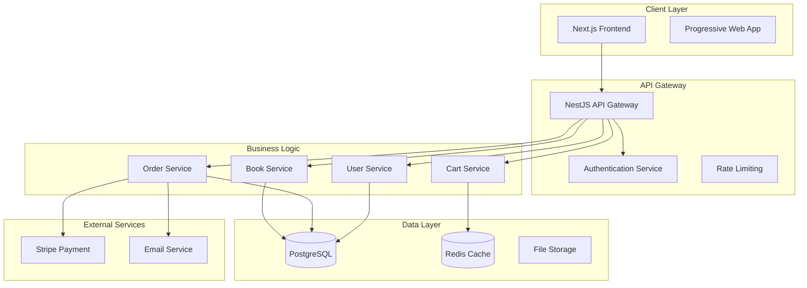
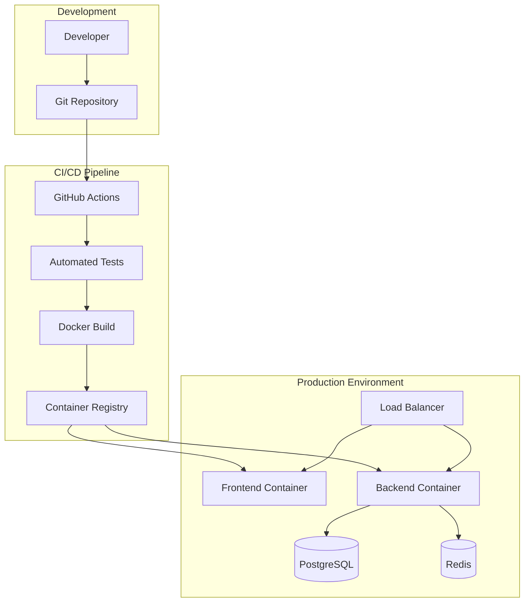

# Design Document: Online Bookstore System

## Overview

The Online Bookstore System is a modern, full-stack web application built with cutting-edge technologies. The system follows a microservices-inspired architecture with clear separation between frontend and backend services, containerized deployment, and automated CI/CD pipeline.

**Technology Stack:**
- **Frontend**: Next.js 15 with App Router, React 19, TailwindCSS v4, shadcn/ui components
- **Backend**: NestJS 10 with TypeScript, PostgreSQL 16, Prisma ORM 5.x
- **Infrastructure**: Docker containers, GitHub Actions CI/CD, multi-stage builds
- **Authentication**: JWT-based authentication with secure session management
- **Payment**: Stripe integration for secure payment processing

## Architecture

The system follows a client-server architecture with the following key principles:

### High-Level Architecture



### Deployment Architecture



## Components and Interfaces

### Frontend Components (Next.js 15 + shadcn/ui)

**Core UI Components:**
- `BookCard`: Displays book information with cover, title, author, price
- `SearchBar`: Advanced search with filters and autocomplete
- `ShoppingCart`: Cart management with quantity controls
- `CheckoutForm`: Multi-step checkout with payment integration
- `OrderHistory`: User order tracking and management
- `AdminDashboard`: Analytics and management interface

**Layout Components:**
- `Header`: Navigation with user authentication state
- `Footer`: Site information and links
- `Sidebar`: Category navigation and filters
- `Layout`: Main application wrapper with responsive design

**Form Components (using shadcn/ui):**
- `LoginForm`: User authentication
- `RegisterForm`: User registration with validation
- `BookForm`: Admin book management
- `ProfileForm`: User profile management

### Backend Services (NestJS 10)

**Authentication Module:**
```typescript
interface AuthService {
  register(userData: CreateUserDto): Promise<User>
  login(credentials: LoginDto): Promise<AuthResult>
  validateToken(token: string): Promise<User>
  refreshToken(refreshToken: string): Promise<AuthResult>
}
```

**Book Management Module:**
```typescript
interface BookService {
  findAll(filters: BookFilters): Promise<PaginatedBooks>
  findById(id: string): Promise<Book>
  create(bookData: CreateBookDto): Promise<Book>
  update(id: string, updateData: UpdateBookDto): Promise<Book>
  delete(id: string): Promise<void>
  updateInventory(id: string, quantity: number): Promise<Book>
}
```

**Order Processing Module:**
```typescript
interface OrderService {
  createOrder(orderData: CreateOrderDto): Promise<Order>
  processPayment(orderId: string, paymentData: PaymentDto): Promise<PaymentResult>
  updateOrderStatus(orderId: string, status: OrderStatus): Promise<Order>
  getUserOrders(userId: string): Promise<Order[]>
  cancelOrder(orderId: string): Promise<Order>
}
```

**Cart Management Module:**
```typescript
interface CartService {
  getCart(userId: string): Promise<Cart>
  addItem(userId: string, item: CartItem): Promise<Cart>
  updateItem(userId: string, itemId: string, quantity: number): Promise<Cart>
  removeItem(userId: string, itemId: string): Promise<Cart>
  clearCart(userId: string): Promise<void>
}
```

## Data Models

### Database Schema (Prisma)

```prisma
model User {
  id        String   @id @default(cuid())
  email     String   @unique
  password  String
  firstName String
  lastName  String
  role      Role     @default(USER)
  createdAt DateTime @default(now())
  updatedAt DateTime @updatedAt
  
  orders    Order[]
  cart      CartItem[]
  
  @@map("users")
}

model Book {
  id          String   @id @default(cuid())
  isbn        String   @unique
  title       String
  author      String
  description String?
  price       Decimal  @db.Decimal(10, 2)
  inventory   Int      @default(0)
  category    String
  imageUrl    String?
  createdAt   DateTime @default(now())
  updatedAt   DateTime @updatedAt
  
  orderItems  OrderItem[]
  cartItems   CartItem[]
  
  @@map("books")
}

model Order {
  id          String      @id @default(cuid())
  userId      String
  status      OrderStatus @default(PENDING)
  totalAmount Decimal     @db.Decimal(10, 2)
  createdAt   DateTime    @default(now())
  updatedAt   DateTime    @updatedAt
  
  user        User        @relation(fields: [userId], references: [id])
  items       OrderItem[]
  payment     Payment?
  
  @@map("orders")
}

model OrderItem {
  id       String  @id @default(cuid())
  orderId  String
  bookId   String
  quantity Int
  price    Decimal @db.Decimal(10, 2)
  
  order    Order   @relation(fields: [orderId], references: [id])
  book     Book    @relation(fields: [bookId], references: [id])
  
  @@map("order_items")
}

model CartItem {
  id       String @id @default(cuid())
  userId   String
  bookId   String
  quantity Int
  
  user     User   @relation(fields: [userId], references: [id])
  book     Book   @relation(fields: [bookId], references: [id])
  
  @@unique([userId, bookId])
  @@map("cart_items")
}

model Payment {
  id              String        @id @default(cuid())
  orderId         String        @unique
  stripePaymentId String        @unique
  amount          Decimal       @db.Decimal(10, 2)
  status          PaymentStatus @default(PENDING)
  createdAt       DateTime      @default(now())
  
  order           Order         @relation(fields: [orderId], references: [id])
  
  @@map("payments")
}

enum Role {
  USER
  ADMIN
}

enum OrderStatus {
  PENDING
  CONFIRMED
  SHIPPED
  DELIVERED
  CANCELLED
}

enum PaymentStatus {
  PENDING
  COMPLETED
  FAILED
  REFUNDED
}
```

### API Response Models

```typescript
interface ApiResponse<T> {
  success: boolean
  data?: T
  error?: string
  message?: string
}

interface PaginatedResponse<T> {
  items: T[]
  total: number
  page: number
  limit: number
  totalPages: number
}

interface BookResponse {
  id: string
  isbn: string
  title: string
  author: string
  description?: string
  price: number
  inventory: number
  category: string
  imageUrl?: string
  inStock: boolean
}

interface OrderResponse {
  id: string
  status: OrderStatus
  totalAmount: number
  createdAt: string
  items: OrderItemResponse[]
  payment?: PaymentResponse
}
```

## Correctness Properties

*A property is a characteristic or behavior that should hold true across all valid executions of a system—essentially, a formal statement about what the system should do. Properties serve as the bridge between human-readable specifications and machine-verifiable correctness guarantees.*

After analyzing the acceptance criteria, I've identified several key properties that can be consolidated to avoid redundancy while maintaining comprehensive coverage:

### Authentication and Security Properties

**Property 1: User Registration Integrity**
*For any* valid user registration data, creating an account should result in a new user record with securely hashed password and no plain text password storage.
**Validates: Requirements 1.1, 1.5**

**Property 2: Authentication Round Trip**
*For any* registered user, successful login followed by accessing protected resources should maintain consistent user identity and permissions throughout the session.
**Validates: Requirements 1.2, 1.4**

**Property 3: Session Lifecycle Management**
*For any* authenticated user session, logout should invalidate the session such that subsequent requests with that session token are rejected.
**Validates: Requirements 1.6**

**Property 4: Password Reset Security**
*For any* user requesting password reset, the system should generate a unique, time-limited reset token and send it via email without exposing sensitive information.
**Validates: Requirements 1.3**

### Book Management Properties

**Property 5: Book Data Integrity**
*For any* book creation or update operation, all required fields (title, author, price, inventory) should be validated and stored correctly with unique ISBN enforcement.
**Validates: Requirements 2.1, 2.2, 2.4, 2.6**

**Property 6: Book Deletion Preservation**
*For any* book deletion operation, the book should be removed from the catalog while preserving all historical order references to maintain data integrity.
**Validates: Requirements 2.3**

**Property 7: Inventory State Management**
*For any* book with inventory count, when inventory reaches zero, the book should be marked as out of stock and unavailable for new cart additions.
**Validates: Requirements 2.5**

### Search and Browse Properties

**Property 8: Search Result Relevance**
*For any* search query, all returned results should match the search terms in title, author, or description fields and be properly paginated.
**Validates: Requirements 3.1, 3.4**

**Property 9: Filter and Sort Consistency**
*For any* combination of filters and sort criteria, the results should match all selected filters and be ordered according to the specified sort attribute.
**Validates: Requirements 3.2, 3.3**

**Property 10: Book Detail Completeness**
*For any* book in the system, viewing book details should display all available information including current availability status.
**Validates: Requirements 3.5, 3.6**

### Cart Management Properties

**Property 11: Cart Operation Consistency**
*For any* cart modification (add, update, remove), the cart total should be recalculated correctly and inventory availability should be validated before allowing additions.
**Validates: Requirements 4.1, 4.2, 4.3, 4.6**

**Property 12: Cart Persistence Integrity**
*For any* authenticated user, cart contents should persist across sessions and be updated when book availability changes.
**Validates: Requirements 4.4, 4.5**

### Order Processing Properties

**Property 13: Checkout Validation Completeness**
*For any* checkout attempt, the system should validate cart contents, inventory availability, and process payment before creating an order.
**Validates: Requirements 5.1, 5.2**

**Property 14: Order Creation Atomicity**
*For any* successful payment, order creation and inventory reduction should occur atomically, ensuring data consistency.
**Validates: Requirements 5.3**

**Property 15: Payment Failure Handling**
*For any* failed payment, cart contents should remain unchanged and appropriate error messages should be displayed to the user.
**Validates: Requirements 5.4**

**Property 16: Order Confirmation Completeness**
*For any* completed order, a unique order number should be generated and confirmation email with order details should be sent.
**Validates: Requirements 5.5, 5.6**

### Order Management Properties

**Property 17: Order History Accuracy**
*For any* user, order history should display all their orders with complete information and allow PDF receipt downloads.
**Validates: Requirements 6.1, 6.2, 6.3**

**Property 18: Order Lifecycle Management**
*For any* order, status updates should be tracked throughout fulfillment, cancellation should work for eligible orders, and reorder functionality should be available.
**Validates: Requirements 6.4, 6.5, 6.6**

### Admin and Analytics Properties

**Property 19: Report Generation Accuracy**
*For any* report request with date range and category filters, the system should generate accurate data and export it in the requested format (CSV/PDF).
**Validates: Requirements 7.2, 7.5**

**Property 20: Inventory Monitoring Alerting**
*For any* inventory level changes, the system should accurately display current levels and alert for low stock conditions.
**Validates: Requirements 7.3**

**Property 21: Analytics Data Consistency**
*For any* time period, user registration and activity statistics should be calculated accurately and displayed consistently.
**Validates: Requirements 7.4, 7.6**

### API and System Properties

**Property 22: API Input Validation**
*For any* API request, input data should be validated according to schema rules and appropriate HTTP status codes should be returned.
**Validates: Requirements 8.3, 8.4**

**Property 23: Rate Limiting Enforcement**
*For any* sequence of API requests from a single source, rate limiting should be enforced to prevent abuse while allowing legitimate usage.
**Validates: Requirements 8.6**

### Data Integrity Properties

**Property 24: Database Migration Consistency**
*For any* schema change, database migrations should execute successfully and maintain data integrity across all environments.
**Validates: Requirements 9.2**

**Property 25: Referential Integrity Maintenance**
*For any* data modification operation, referential integrity constraints should be maintained and validated before persistence.
**Validates: Requirements 9.3, 9.5**

**Property 26: Connection Failure Recovery**
*For any* database connection failure, the system should implement retry logic and handle failures gracefully without data loss.
**Validates: Requirements 9.6**

### Frontend Performance Properties

**Property 27: Accessibility Compliance**
*For any* UI component, accessibility standards (WCAG 2.1) should be met and verified through automated testing tools.
**Validates: Requirements 10.4**

**Property 28: Navigation Performance**
*For any* client-side navigation, routing should work correctly with optimized loading through lazy loading and code splitting.
**Validates: Requirements 10.5, 10.6**

<function_calls>
<invoke name="prework">
<parameter name="featureName">online-bookstore-system

## Error Handling

### Frontend Error Handling

**User-Friendly Error Messages:**
- Network errors: "Unable to connect. Please check your internet connection."
- Validation errors: Specific field-level feedback with clear instructions
- Authentication errors: Clear login prompts with password reset options
- Payment errors: Detailed payment failure reasons with retry options

**Error Boundaries:**
- React Error Boundaries to catch and display fallback UI for component crashes
- Global error handler for unhandled promise rejections
- Graceful degradation for non-critical features

**Loading States:**
- Skeleton screens for content loading
- Progress indicators for multi-step processes
- Optimistic updates with rollback on failure

### Backend Error Handling

**HTTP Status Codes:**
- 200: Successful operations
- 201: Resource creation
- 400: Bad request with validation details
- 401: Authentication required
- 403: Insufficient permissions
- 404: Resource not found
- 409: Conflict (e.g., duplicate ISBN)
- 422: Validation errors
- 429: Rate limit exceeded
- 500: Internal server error

**Error Response Format:**
```typescript
interface ErrorResponse {
  success: false
  error: {
    code: string
    message: string
    details?: any
    timestamp: string
    requestId: string
  }
}
```

**Database Error Handling:**
- Connection pool management with automatic reconnection
- Transaction rollback on failures
- Constraint violation handling with user-friendly messages
- Deadlock detection and retry logic

**External Service Error Handling:**
- Stripe payment failures with detailed error codes
- Email service failures with retry queues
- Circuit breaker pattern for external API calls

## Testing Strategy

### Dual Testing Approach

The system employs both unit testing and property-based testing to ensure comprehensive coverage:

**Unit Tests:**
- Verify specific examples and edge cases
- Test integration points between components
- Validate error conditions and boundary cases
- Focus on concrete scenarios and known inputs

**Property-Based Tests:**
- Verify universal properties across all inputs
- Test system behavior with randomized data
- Ensure correctness properties hold for all valid inputs
- Minimum 100 iterations per property test

### Testing Framework Configuration

**Frontend Testing (Next.js):**
- **Unit Tests**: Jest + React Testing Library
- **Property Tests**: fast-check library
- **E2E Tests**: Playwright for critical user journeys
- **Component Tests**: Storybook for UI component testing

**Backend Testing (NestJS):**
- **Unit Tests**: Jest with NestJS testing utilities
- **Property Tests**: fast-check for business logic validation
- **Integration Tests**: Supertest for API endpoint testing
- **Database Tests**: In-memory PostgreSQL for isolated testing

### Property Test Configuration

Each property-based test must:
- Run minimum 100 iterations due to randomization
- Reference its corresponding design document property
- Use tag format: **Feature: online-bookstore-system, Property {number}: {property_text}**
- Generate realistic test data within valid input domains
- Provide clear failure messages with counterexamples

### Test Coverage Requirements

**Minimum Coverage Targets:**
- Unit test coverage: 80% for critical business logic
- Property test coverage: All identified correctness properties
- Integration test coverage: All API endpoints
- E2E test coverage: Critical user journeys (registration, purchase, admin tasks)

**Testing Environments:**
- Local development with Docker Compose
- CI/CD pipeline with automated test execution
- Staging environment for integration testing
- Production monitoring with health checks

### Performance Testing

**Load Testing:**
- API endpoint performance under concurrent load
- Database query optimization validation
- Frontend bundle size and loading performance
- Memory usage and garbage collection monitoring

**Security Testing:**
- Authentication and authorization validation
- Input sanitization and SQL injection prevention
- Rate limiting effectiveness
- HTTPS and data encryption verification